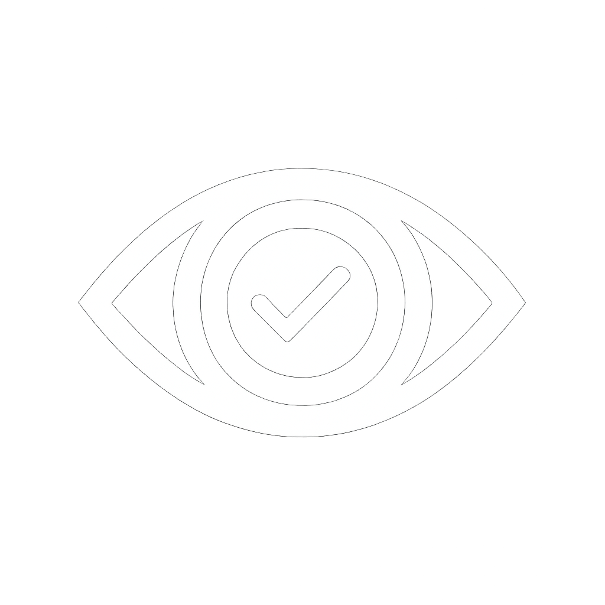
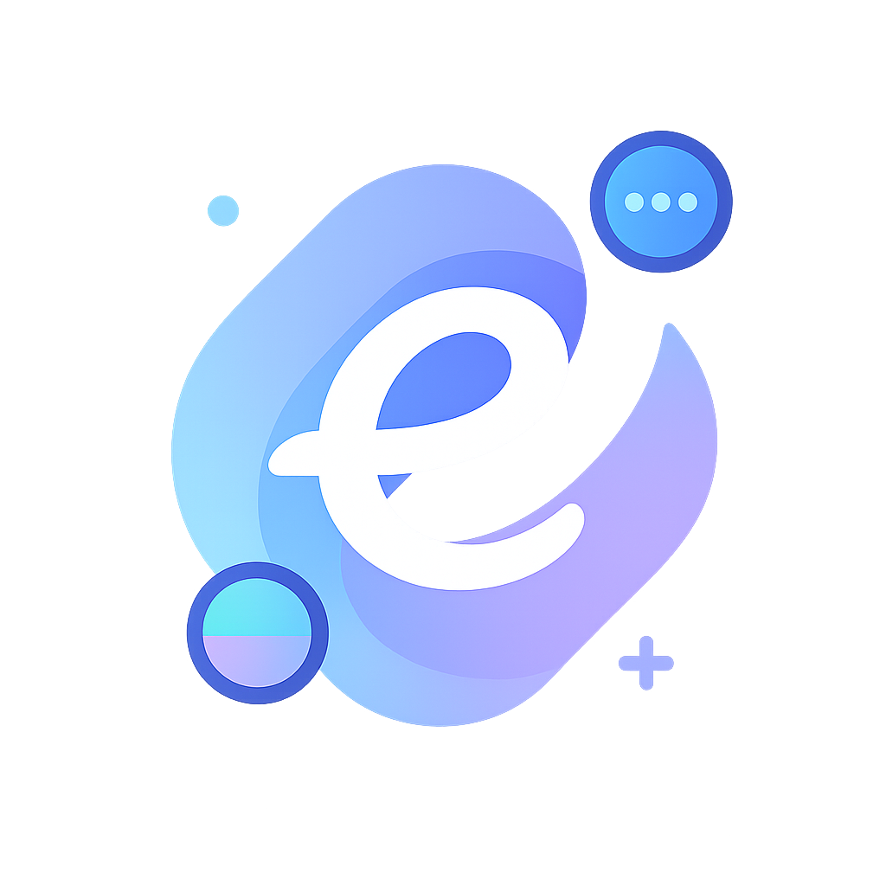
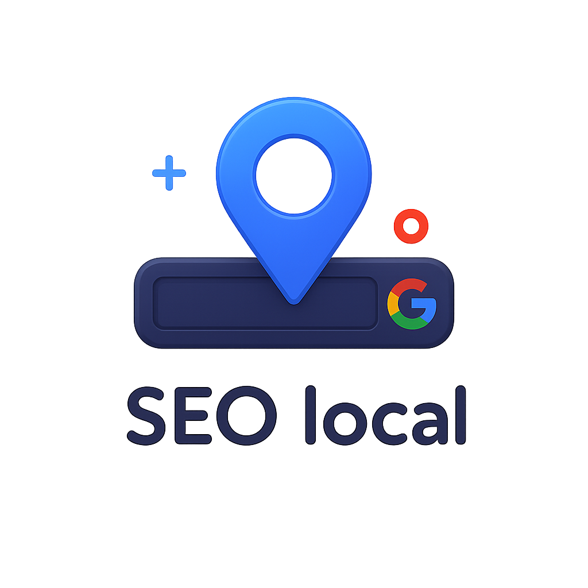
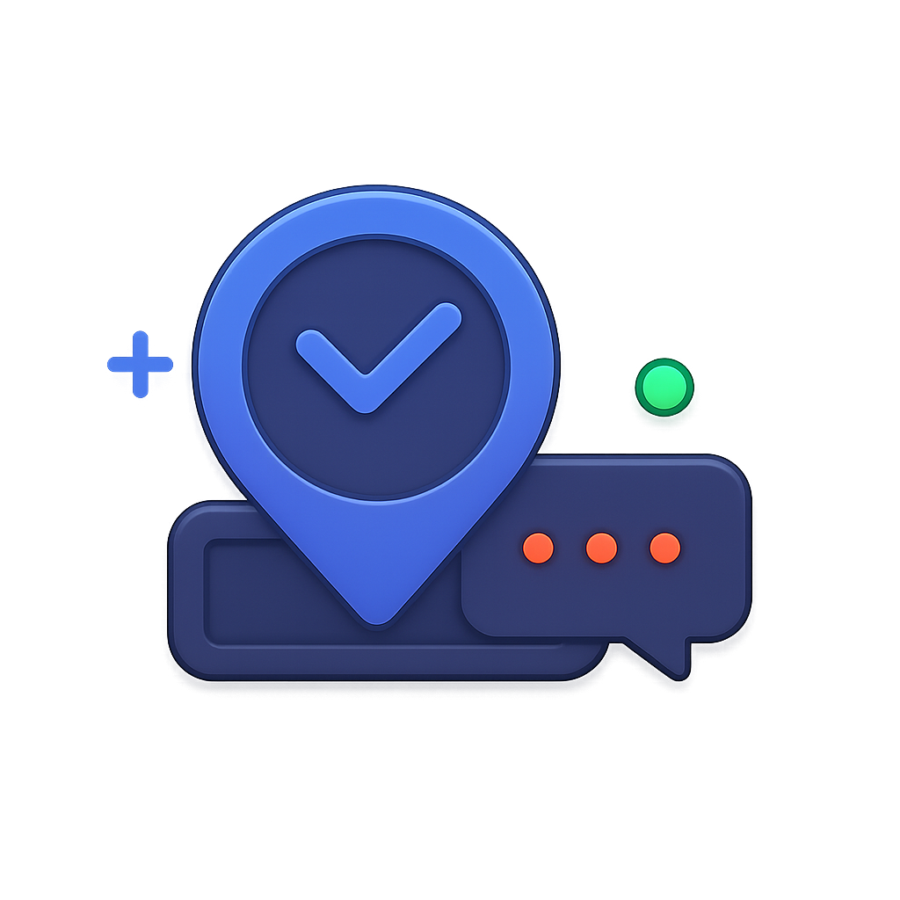
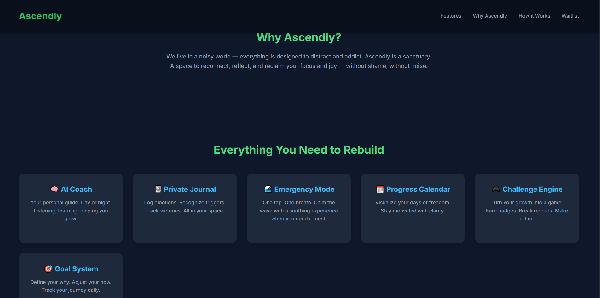
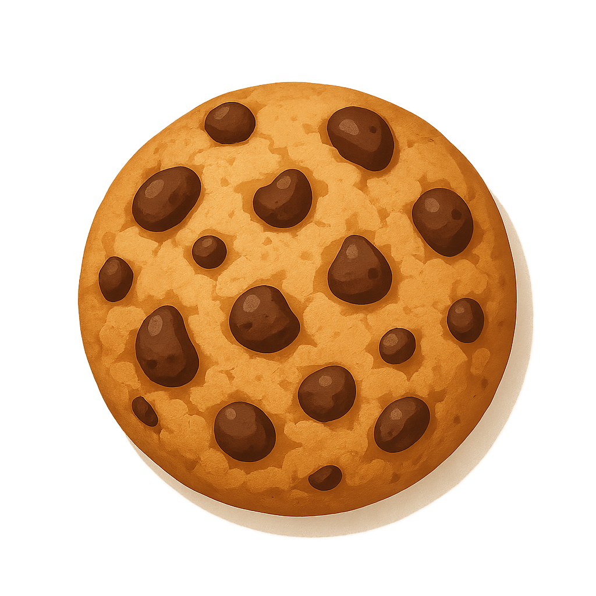

root@DESKTOP-PHBM8T5:/home/souleyman/agence# ls
README.md  img  index.html  pages  public  scripts  seo  styles  weedeeweb.zip
root@DESKTOP-PHBM8T5:/home/souleyman/agence# tree
.
├── README.md
├── img
│   └── bg-decor-about.png
├── index.html
├── pages
│   ├── cgv.html
│   ├── confidentialite.html
│   ├── mentions-legales.html
│   └── merci.html
├── public
│   ├── favicon
│   │   ├── android-chrome-192x192.png
│   │   ├── android-chrome-512x512.png
│   │   ├── apple-touch-icon.png
│   │   ├── favicon-16x16.png
│   │   ├── favicon-32x32.png
│   │   ├── favicon.ico
│   │   └── site.webmanifest
│   ├── icons
│   │   ├── icon-booking.png
│   │   ├── icon-cookie.png
│   │   ├── icon-identity.png
│   │   ├── icon-prenium.png
│   │   ├── icon-responsive.png
│   │   ├── icon-rocket.png
│   │   └── icon-seo.png
│   └── images
│       ├── breaksolidaire.png
│       ├── harpietech.png
│       ├── hero-clarity.png
│       ├── hero-illustration.png
│       ├── logos
│       │   ├── logo-conversion.png
│       │   ├── logo-maquette.png
│       │   ├── logo-popularite.png
│       │   ├── logo-rocket.png
│       │   └── logo-vision.png
│       └── placeholder.png
├── scripts
│   └── script.js
├── seo
│   ├── robots.txt
│   └── sitemap.xml
├── styles
│   ├── confidentialite.css
│   ├── mentions-legales.css
│   └── style.css
└── weedeeweb.zip

10 directories, 38 files

<!DOCTYPE html>
<html lang="fr">
<head>
  
  <meta charset="UTF-8" />
  <meta name="viewport" content="width=device-width, initial-scale=1.0" />
  <meta name="description" content="WeeDeeWeb crée des sites web performants pour les indépendants ambitieux : design premium, SEO local, conversion optimisée, accompagnement personnalisé.">
  <meta name="keywords" content="création site web indépendant, site vitrine freelance, agence web indépendant, WeeDeeWeb, web design, SEO local, site rapide, site optimisé mobile">
  <meta name="author" content="WeeDeeWeb">
  <link rel="icon" href="public/favicon/favicon.ico" type="image/x-icon" />
  <link rel="canonical" href="https://WeeDeeWeb.fr/">

  <link rel="apple-touch-icon" sizes="180x180" href="public/favicon/apple-touch-icon.png">
  <link rel="icon" type="image/png" sizes="32x32" href="public/favicon/favicon-32x32.png">
  <link rel="icon" type="image/png" sizes="16x16" href="public/favicon/favicon-16x16.png">
  <link rel="manifest" href="public/favicon/site.webmanifest">

  <meta property="og:title" content="WeeDeeWeb – Le site web qui convertit vos visiteurs en clients" />
  <meta property="og:description" content="Sites web premium pour indépendants : rapides, responsives et orientés conversion." />
  <meta property="og:image" content="https://WeeDeeWeb.fr/public/images/hero-clarity.png" />
  <meta property="og:url" content="https://WeeDeeWeb.fr/" />
  <meta property="og:type" content="website" />
  <meta name="twitter:card" content="summary_large_image">
  <meta name="twitter:title" content="WeeDeeWeb – Sites web premium pour indépendants">
  <meta name="twitter:description" content="Un site web rapide et optimisé qui transforme chaque visite en client fidèle.">
  <meta name="twitter:image" content="https://WeeDeeWeb.fr/public/images/hero-clarity.png" />

  <title>WeeDeeWeb – Sites web pour indépendants</title>
  <link rel="stylesheet" href="https://cdn.jsdelivr.net/npm/swiper@10/swiper-bundle.min.css"/>
  <link href="https://fonts.googleapis.com/css2?family=Inter:wght@400;600;700&display=swap" rel="stylesheet" />
  <link rel="stylesheet" href="styles/style.css" />
  <link href="https://fonts.googleapis.com/css2?family=Playfair+Display:wght@600;700&display=swap" rel="stylesheet" />
  <link href="https://fonts.googleapis.com/css2?family=Playfair+Display:wght@600;700&display=swap" rel="stylesheet">
</head>

<body>
  

  

  

    

  
  
  <header class="header">
    

      
WeeDeeWeb

      <nav class="nav">
        <a href="#about">À propos</a>
        <a href="#services">Services</a>
        <a href="#portfolio">Réalisations</a>
        <a href="#pricing">Tarifs</a>
        <a href="#contact">Contact</a>
        <a href="#quote" class="btn-cta" style="color: white;">Demander un devis</a>
      </nav>
    

  </header>

  <section class="hero-section">
    

      

        <h1>Le site web qui transforme chaque visite en client fidèle</h1>
        
Vous perdez des clients chaque jour sans le savoir. 
          Un site professionnel, rapide et optimisé peut devenir votre meilleur commercial.
        

        
<strong>Nous ne créons pas seulement un site, nous propulsons votre activité.</strong>

        <a href="#services" class="btn-primary">Découvrir comment</a>
      

  
      

        
      

    

    
    <!-- Bande défilante de logos -->
    

      

        

          
          
          
          
          
        

        

          
          
          
          
          
        

        

          
          
          
          
          
        

        

          
          
          
          
          
        

      

    

    
  </section>

  <section id="about" class="about-section-uiux" data-animate>
    

      <h2 class="about-heading">
        Le site web n’est plus une option.
        C’est votre levier de croissance
      </h2>
      

        <strong>Chez WeeDeeWeb</strong>, nous ne faisons pas que du design. Nous construisons votre <em>machine à attirer des clients</em>.
      

      

        Chaque ligne de code, chaque élément graphique, chaque interaction est pensé pour une seule chose : <strong>vous faire gagner des clients</strong>.
        Grâce à une synergie entre design émotionnel, stratégie data-driven et psychologie utilisateur, nous transformons votre présence en ligne en <strong>atout commercial</strong>.
      

      

        Votre futur client est déjà en ligne. La vraie question, c’est : <strong>est-ce qu’il vous trouve ?</strong> Et s’il vous trouve... est-ce qu’il vous choisit ?
      

      <a href="#contact" class="btn-primary magnetic-btn">Votre croissance commence ici</a>
    

  </section>
  

  <section id="services" class="services">
    

      <h2>Des services pensés pour convertir</h2>
      

        
        

          

            
          

          <h3>Site responsive</h3>
          
Un design adapté à tous les écrans pour un rendu professionnel partout.

        

  
        

          

            
          

          <h3>Identité visuelle</h3>
          
Logo, couleurs, typographie... On construit votre image de marque ensemble.

        

  
        

          

            
          

          <h3>SEO local</h3>
          
Boostez votre visibilité sur Google dans votre ville ou région.

        

  
        

          

            
          

          <h3>Réservation en ligne</h3>
          
Prise de rendez-vous intégrée via WhatsApp, Calendly ou Doctolib.

        

  
        

          

            
          

          <h3>Accompagnement Premium</h3>
          
Conseil stratégique, tunnel de vente, design personnalisé.

        

  
        

          

            
          

          <h3>Lancement express</h3>
          
Votre site prêt en 72h pour démarrer rapidement votre activité.

        

  
      

    

  </section>
  
  <section id="portfolio" class="portfolio-section">
    

      <h2>Nos dernières réalisations</h2>
      

        

          <a href="public/images/breaksolidaire.png" class="lightbox">
            

              
            

          </a>
          
Breaksolidaire : plateforme engagée pour les jeunes

          <a href="https://break-solidaire.com/" target="_blank" class="btn-cta site">Voir le site</a>
        

        

          <a href="public/images/harpietech.png" class="lightbox">
            

              
            

          </a>
          
Harpie Tech : solution SaaS moderne pour entreprise tech

          <a href="https://www.harpie-tech.com/" target="_blank" class="btn-cta site">Voir le site</a>
        

        

          <a href="public/images/placeholder.png" class="lightbox">
            

              
            

          </a>
          
UNE ÉNORME PROJET WEB POUR UN CLIENT TRÈS AMBITIEUX DANS LE DOMAINE MÉDICAL

          
🤫

        

      

    

  </section>

  <section id="pricing" class="pricing-section">
    

      <h2>Des offres taillées pour transformer votre présence en ligne en machine à clients</h2>
      

  
        

          <h3>Essentiel</h3>
          
Lancez-vous rapidement avec un site pro, beau et crédible

          <h4>899€</h4>
          <ul>
            <li>Landing page moderne, 100% responsive</li>
            <li>Formulaire de contact relié à votre boîte mail</li>
            <li>Optimisé mobile, rapide et prêt à convertir</li>
          </ul>
          <a href="#contact" class="btn-primary price">Je démarre</a>
        

  
        

          <h3>Pro</h3>
          
Pour ceux qui veulent structurer leur image et devenir inoubliables

          <h4>1299€</h4>
          <ul>
            <li>Site complet multi-pages sur mesure</li>
            <li>Logo & identité visuelle professionnelle</li>
            <li>Référencement local + Google Analytics installé</li>
          </ul>
          <a href="#contact" class="btn-primary price">Je me démarque</a>
        

  
        

          <h3>Signature</h3>
          
Notre offre phare : accompagnement stratégique + site premium ultra-convertissant

          <h4>1999€</h4>
          <ul>
            <li>Site unique, ultra-rapide, pensé pour vendre</li>
            <li>Tunnel de conversion + prise de RDV automatisée (Calendly, WhatsApp...)</li>
            <li>Coaching 1:1 pendant 30 jours pour faire exploser votre visibilité</li>
          </ul>
          <a href="#contact" class="btn-primary price">Je veux exploser mon activité</a>
        

  
      

    

  </section>
  

  <section id="contact" class="contact-section" data-animate>
    

      <h2 class="contact-title">Prêt à booster votre activité ?</h2>
      
Parlez-nous de vos besoins et laissez-nous transformer vos idées en réalité digitale.

      <form class="contact-form enhanced-form" action="https://formsubmit.co/el/codifu" method="POST">
        <input type="text" name="_honey" style="display:none">
        <input type="hidden" name="_captcha" value="false">
        <input type="hidden" name="_next" value="http://localhost:8080/merci.html">

        

          <input type="text" name="name" placeholder="Votre nom" required />
          <input type="email" name="email" placeholder="Votre e-mail" required />
        

        <textarea name="message" placeholder="Décrivez votre projet..." rows="6" required></textarea>
        <button type="submit" class="btn-primary">Envoyer ma demande</button>
        <!-- Calendly inline widget -->
       <!--  

         -->
      

        
        <!--<a href="https://wa.me/33612345678?text=Bonjour%20WeeDeeWeb%2C%20je%20souhaite%20échanger%20sur%20mon%20projet%20web." 
        class="btn-primary" 
        target="_blank">
        Réserver via WhatsApp
        </a>
        -->
      
      </form>
    

  </section>

  <footer class="footer">
    

      

        
WDW

        
Sites web performants pour indépendants ambitieux.

      

  
      

        <h4>Navigation</h4>
        <ul>
          <li><a href="#about">À propos</a></li>
          <li><a href="#services">Services</a></li>
          <li><a href="#portfolio">Réalisations</a></li>
          <li><a href="#pricing">Tarifs</a></li>
          <li><a href="#contact">Contact</a></li>
        </ul>
      

  
      

        <h4>Informations</h4>
        <ul>
          <li><a href="pages/mentions-legales.html">Mentions légales</a></li>
          <li><a href="pages/confidentialite.html">Politique de confidentialité</a></li>
          <li><a href="pages/cgv.html">Conditions générales de vente</a></li>
        </ul>
      

    

  
    

      
&copy; 2025 WeeDeeWeb. Tous droits réservés.

    

  </footer>
  
  

    &times;
    
  

  

    

      
      Nous utilisons des cookies pour améliorer votre expérience et analyser notre trafic. 
      <a href="pages/confidentialite.html" class="cookie-link">En savoir plus</a>
    

    
  
    

      <button id="accept-cookies" class="btn-cta">Accepter</button>
      <button id="decline-cookies" class="btn-outline">Refuser</button>
    

  

  
  
  
  
</body>

</html>

<!DOCTYPE html>
<html lang="fr">
<head>
  <meta charset="UTF-8">
  <meta name="viewport" content="width=device-width, initial-scale=1.0">
  <meta name="description" content="WeeDeeWeb crée des sites web performants pour les indépendants ambitieux : design premium, SEO local, conversion optimisée, accompagnement personnalisé.">
  <meta name="keywords" content="création site web indépendant, site vitrine freelance, agence web indépendant, WeeDeeWeb, web design, SEO local, site rapide, site optimisé mobile">
  <meta name="author" content="WeeDeeWeb">
  <link rel="canonical" href="https://WeeDeeWeb.fr/">
  <title>Conditions Générales de Vente – WeeDeeWeb</title>
  <link rel="stylesheet" href="../styles/style.css">
  
</head>
<body>
  

    <h1>Conditions Générales de Vente (CGV)</h1>

    
Les présentes conditions générales de vente s’appliquent à toutes les prestations proposées par WeeDeeWeb. En acceptant un devis ou en passant commande, le client reconnaît avoir pris connaissance et accepté les présentes CGV.

    <h2>1. Prestations proposées</h2>
    
WeeDeeWeb propose la création de sites web sur mesure, des services de design, de stratégie digitale et d’accompagnement marketing pour les professionnels indépendants et petites entreprises.

    <h2>2. Devis et commandes</h2>
    
Tout devis établi par WeeDeeWeb est valable 30 jours. La commande est considérée comme validée à réception du devis signé ou d’un acompte.

    <h2>3. Tarifs et modalités de paiement</h2>
    
Les prix sont indiqués en euros, hors taxes. Le paiement s’effectue selon les modalités définies dans le devis : acompte à la commande, solde à la livraison. En cas de retard, des sanctions peuvent s’appliquer.

    <h2>4. Délais de réalisation</h2>
    
Les délais sont donnés à titre indicatif. WeeDeeWeb s’engage à informer le client de tout retard ou obstacle éventuel à la réalisation du projet.

    <h2>5. Obligations du client</h2>
    <ul>
      <li>Fournir les contenus nécessaires (textes, images, accès techniques) dans les délais.</li>
      <li>Respecter le calendrier défini pour les retours et validations.</li>
    </ul>

    <h2>6. Propriété intellectuelle</h2>
    
Les créations restent la propriété de WeeDeeWeb jusqu’au paiement intégral. À réception du paiement, les droits d’exploitation sont transférés au client.

    <h2>7. Responsabilité</h2>
    
WeeDeeWeb ne saurait être tenu responsable des dommages indirects, ou de l’utilisation abusive des sites livrés. Le client est responsable du contenu publié.

    <h2>8. Confidentialité</h2>
    
WeeDeeWeb s’engage à respecter la confidentialité des informations et documents transmis par le client.

    <h2>9. Droit applicable</h2>
    
Les présentes CGV sont soumises au droit français. En cas de litige, une tentative de résolution amiable sera privilégiée avant toute procédure judiciaire.

    <footer>
      Dernière mise à jour : 3 mai 2025 – WeeDeeWeb
    </footer>
  

</body>
</html>

 <!DOCTYPE html>
<html lang="fr">
<head>
  <meta charset="UTF-8" />
  <meta name="description" content="Découvrez la politique de confidentialité de WeeDeeWeb : comment nous collectons, utilisons et protégeons vos données personnelles.">
  <title>Politique de Confidentialité – WeeDeeWeb</title>
  <meta name="description" content="WeeDeeWeb crée des sites web performants pour les indépendants ambitieux : design premium, SEO local, conversion optimisée, accompagnement personnalisé.">
  <meta name="keywords" content="création site web indépendant, site vitrine freelance, agence web indépendant, WeeDeeWeb, web design, SEO local, site rapide, site optimisé mobile">
  <meta name="author" content="WeeDeeWeb">
  <link rel="canonical" href="https://WeeDeeWeb.fr/">

  <link rel="stylesheet" href="../styles/confidentialite.css" />
  
</head>
<body>
  <main class="legal-container">
    <h1>Politique de Confidentialité</h1>

    
Cette politique de confidentialité décrit comment WeeDeeWeb collecte, utilise et protège les informations personnelles que vous nous fournissez.

    <h2>1. Collecte des données</h2>
    
Nous collectons des informations personnelles telles que votre nom, votre adresse e-mail et votre message lorsque vous utilisez notre formulaire de contact.

    <h2>2. Utilisation des données</h2>
    
Vos données sont utilisées uniquement pour répondre à vos demandes, vous contacter ou améliorer nos services. Aucune donnée n’est vendue à des tiers.

    <h2>3. Sécurité</h2>
    
Nous mettons en place toutes les mesures techniques nécessaires pour protéger vos données contre l'accès non autorisé ou la divulgation.

    <h2>4. Vos droits</h2>
    
Conformément au RGPD, vous avez le droit d’accéder, de corriger, de supprimer ou de limiter l’usage de vos données personnelles. Pour toute demande, contactez-nous à l’adresse suivante : contact@WeeDeeWeb.fr.

    <h2>5. Cookies</h2>
    
Nous n’utilisons actuellement pas de cookies traceurs. Si cela devait changer, vous en seriez informé via un bandeau et une option de consentement.

    <h2>6. Modification</h2>
    
WeeDeeWeb se réserve le droit de modifier cette politique à tout moment. Nous vous recommandons de la consulter régulièrement.

    
Dernière mise à jour : 3 mai 2025

  </main>
</body>
</html>

<!DOCTYPE html>
<html lang="fr">
<head>
  <meta charset="UTF-8">
  <meta name="viewport" content="width=device-width, initial-scale=1.0">
  <meta name="description" content="WeeDeeWeb crée des sites web performants pour les indépendants ambitieux : design premium, SEO local, conversion optimisée, accompagnement personnalisé.">
  <meta name="keywords" content="création site web indépendant, site vitrine freelance, agence web indépendant, WeeDeeWeb, web design, SEO local, site rapide, site optimisé mobile">
  <meta name="author" content="WeeDeeWeb">
  <link rel="canonical" href="https://WeeDeeWeb.fr/">
  <title>Mentions Légales - WeeDeeWeb</title>
  <link rel="stylesheet" href="../styles/mentions-legales.css">
  <link href="https://fonts.googleapis.com/css2?family=Inter:wght@400;600;700&display=swap" rel="stylesheet">
</head>
<body>
  <main class="legal-wrapper">
    <h1>Mentions Légales</h1>

    <section>
      <h2>1. Éditeur du site</h2>
      
<strong>WeeDeeWeb</strong> – Autoentreprise enregistrée sous le numéro SIRET 123 456 789 00000 
      Responsable de la publication : Souleyman Yacef 
      Contact : contact@WeeDeeWeb.fr

    </section>

    <section>
      <h2>2. Hébergement</h2>
      
Le site est hébergé par : 
      <strong>Hostinger International Ltd.</strong> 
      61 Lordou Vironos Street, 6023 Larnaca, Chypre 
      Site web : <a href="https://www.hostinger.fr">www.hostinger.fr</a>

    </section>

    <section>
      <h2>3. Propriété intellectuelle</h2>
      
Tous les contenus du site WeeDeeWeb (textes, images, graphismes, logo, icônes, etc.) sont protégés par le droit d’auteur. Toute reproduction, distribution ou utilisation sans autorisation écrite est strictement interdite.

    </section>

    <section>
      <h2>4. Données personnelles</h2>
      
Conformément à la loi Informatique et Libertés et au RGPD, l’utilisateur dispose d’un droit d’accès, de rectification et de suppression des données le concernant. Pour exercer ces droits, contactez : contact@WeeDeeWeb.fr

    </section>

    <section>
      <h2>5. Cookies</h2>
      
Le site peut utiliser des cookies afin d'améliorer l’expérience utilisateur. L’utilisateur peut configurer son navigateur pour refuser l’installation des cookies.

    </section>

    <footer class="legal-footer">
      
&copy; 2025 WeeDeeWeb. Tous droits réservés.

    </footer>
  </main>
</body>
</html>

<!DOCTYPE html>
<html lang="fr">
<head>
  <meta charset="UTF-8" />
  <meta name="viewport" content="width=device-width, initial-scale=1.0" />
  <meta name="description" content="WeeDeeWeb crée des sites web performants pour les indépendants ambitieux : design premium, SEO local, conversion optimisée, accompagnement personnalisé.">
  <meta name="keywords" content="création site web indépendant, site vitrine freelance, agence web indépendant, WeeDeeWeb, web design, SEO local, site rapide, site optimisé mobile">
  <meta name="author" content="WeeDeeWeb">
  <link rel="canonical" href="https://WeeDeeWeb.fr/">
  <title>Merci – WeeDeeWeb</title>
  <link href="https://fonts.googleapis.com/css2?family=Inter:wght@400;600;700&display=swap" rel="stylesheet" />
  <link rel="stylesheet" href="../styles/style.css" />
  
</head>
<body>

  

    <h1>Merci pour votre message !</h1>
    
Nous avons bien reçu votre demande. Nous reviendrons vers vous dans les plus brefs délais.

    

      <a href="index.html">Retour à l’accueil</a>
    

  

  
  

</body>
</html>

User-agent: *
Allow: /

Sitemap: https://WeeDeeWeb.fr/seo/sitemap.xml

<?xml version="1.0" encoding="UTF-8"?>
<urlset xmlns="http://www.sitemaps.org/schemas/sitemap/0.9">
  <url>
    <loc>https://weedeeweb.com/</loc>
    <priority>1.0</priority>
  </url>
  <url>
    <loc>https://weedeeweb.com/#about</loc>
    <priority>0.8</priority>
  </url>
  <url>
    <loc>https://weedeeweb.com/#services</loc>
    <priority>0.8</priority>
  </url>
  <url>
    <loc>https://weedeeweb.com/#portfolio</loc>
    <priority>0.7</priority>
  </url>
  <url>
    <loc>https://weedeeweb.com/#pricing</loc>
    <priority>0.7</priority>
  </url>
  <url>
    <loc>https://weedeeweb.com/#contact</loc>
    <priority>0.7</priority>
  </url>
</urlset>

/* ================================
   WeeDeeWeb - style.css premium
   ================================ */

   :root {
    --primary: #7b61ff;
    --secondary: #21d4fd;    
    --primary-light: #a074ff;
    --secondary-light: #ffb085;
    --dark: #1a1a1a;
    --light: #f8f9fb;
    --white: #ffffff;
    --gray: #888;
    --text: #333;
    --shadow: rgba(0, 0, 0, 0.08);
    --radius: 12px;
    --transition: 0.3s ease;
    --gradient: linear-gradient(135deg, #7b61ff, #21d4fd);
    --fast-transition: 0.25s ease-in-out;
  }
  
  * {
    margin: 0;
    padding: 0;
    box-sizing: border-box;
    transition: var(--fast-transition);
  }

  .custom-cursor {
    position: fixed;
    top: 0;
    left: 0;
    width: 20px;
    height: 20px;
    border: 2px solid var(--primary);
    border-radius: 50%;
    pointer-events: none;
    transform: translate(-50%, -50%);
    transition: transform 0.15s ease;
    z-index: 10000;
  }
  
  .custom-cursor.hover {
    transform: translate(-50%, -50%) scale(1.5);
    background-color: var(--primary-light);
  }
  
  body {
    font-family: 'Inter', sans-serif;
    background-color: var(--white);
    color: var(--text);
    line-height: 1.6;
    scroll-behavior: smooth;
  }

  .container {
    width: 90%;
    max-width: 1200px;
    margin: auto;
  }
  
  #preloader {
    position: fixed;
    top: 0;
    left: 0;
    width: 100%;
    height: 100%;
    background: var(--white);
    display: flex;
    align-items: center;
    justify-content: center;
    z-index: 9999;
  }
  
  .loader {
    width: 60px;
    height: 60px;
    border: 6px solid var(--primary-light);
    border-top: 6px solid var(--primary);
    border-radius: 50%;
    animation: spin 1s linear infinite;
  }
  
  @keyframes spin {
    to {
      transform: rotate(360deg);
    }
  }
  
  .parallax-img {
    will-change: transform;
    transition: transform 0.2s ease-out;
  }
  
  .header {
    background: var(--white);
    padding: 1.5rem 0;
    position: sticky;
    top: 0;
    z-index: 1000;
    box-shadow: 0 4px 12px var(--shadow);
  }
  
  .header .container {
    display: flex;
    justify-content: space-between;
    align-items: center;
    flex-wrap: wrap;
  }
  
  .logo {
    font-size: 2rem;
    font-weight: 700;
    background: var(--gradient);
    -webkit-background-clip: text;
    -webkit-text-fill-color: transparent;
  }
  
  .nav {
    display: flex;
    gap: 1.5rem;
    align-items: center;
  }
  
  .nav a {
    text-decoration: none;
    color: var(--text);
    font-weight: 500;
    transition: color var(--transition);
    position: relative;
  }
  
  .nav a::after {
    content: '';
    position: absolute;
    bottom: -6px;
    left: 0;
    width: 0;
    height: 2px;
    background: var(--primary);
    transition: width 0.3s;
  }
  
  .nav a:hover {
    color: var(--primary);
  }
  
  .nav a:hover::after {
    width: 100%;
  }

/* === Animation visuelle au clic sur un lien de la navbar === */
.nav a.active-anim {
  position: relative;
  color: var(--primary);
}

/* Barre de soulignement animée */
.nav a.active-anim::after,
.nav a.animate::after {
  content: '';
  position: absolute;
  left: 0;
  bottom: -4px;
  width: 100%;
  height: 2px;
  background: var(--primary, #7b61ff);
  transform: scaleX(0);
  transform-origin: left;
  transition: transform 0.3s ease;
}

/* Déclenche l’animation */
.nav a.animate::after {
  transform: scaleX(1);
}

  
  .btn-cta {
    display: inline-block;
    padding: 0.6rem 1.4rem;
    border-radius: 50px;
    font-weight: 600;
    background: var(--gradient);
    color: #fff;
    text-decoration: none;
    position: relative;
    overflow: hidden;
    transition: all 0.4s ease;
    border: none;
    z-index: 1;
    text-align: center;
  }
  
  .project-description {
    margin-top: 1.5rem; /* ou 5% si tu préfères en pourcentage */
  }
  
  .project-description.secret {
    text-transform: uppercase;
    margin-top: 1.5rem;
  }
  
  .emoji-secret {
    font-size: 2rem;
    text-align: center;
    margin-top: 1rem;
  }
  

  .btn-cta::before {
    content: '';
    position: absolute;
    width: 100%;
    height: 100%;
    background: linear-gradient(135deg, #21d4fd, #7b61ff);
    top: 0;
    left: -100%;
    transition: 0.4s ease;
    z-index: -1;
  }
  
  .btn-cta:hover::before {
    left: 0;
  }
  
  .btn-cta:hover {
    transform: scale(1.05);
  }
  
  .btn-cta.site {
    margin-top: 1.5rem; /* ou 5%, selon ton design */
    display: inline-block;
  }
  
  /* Spécifique au header */
  .nav .nav-btn {
    margin-left: 1rem;
    font-size: 0.95rem;
    padding: 0.5rem 1.2rem;
    white-space: nowrap;
  }
  
  .hero-section {
    position: relative;
    background: linear-gradient(to right, #1e1e2f, #10111f);
    color: var(--white);
    padding: 5rem 2rem 2rem; /* Moins d'espace en bas */
    overflow: hidden;
  }
  
  
  .hero-title {
    font-size: 3.4rem;
    font-weight: 800;
    line-height: 1.2;
    margin-bottom: 1rem;
    background: linear-gradient(135deg, var(--primary), var(--secondary));
    -webkit-background-clip: text;
    -webkit-text-fill-color: transparent;
  }
  
  .hero-content {
    flex: 1;
    min-width: 320px;
    max-width: 600px;
  }
  
  .hero-grid {
    display: flex;
    align-items: center;
    justify-content: space-between;
    flex-wrap: wrap;
    gap: 3rem;
  }

  .hero-content h1 {
    font-size: 3.6rem;
    font-weight: 800;
    line-height: 1.2;
    margin-bottom: 1.2rem;
  }

  .hero-content h1 span {
    display: inline-block;
    padding: 0.2em 0.6em;
    background: rgba(255, 255, 255, 0.05);
    border: 1px solid rgba(255, 255, 255, 0.15);
    border-radius: 8px;
    color: var(--white);
    box-shadow: 0 0 12px rgba(33, 212, 253, 0.3);
    backdrop-filter: blur(6px);
    font-weight: 700;
    font-size: 3.6rem;
    animation: pulseBorder 1.4s ease-in-out infinite;
  }
  
  
  .hero-content p {
    font-size: 1.25rem;
    margin-bottom: 1.5rem;
    font-weight: 500;
    color: var(--white);
  }

  .hero p {
    font-size: 1.2rem;
    margin-bottom: 2rem;
    font-weight: 500;
  }
  
  .btn-primary {
    display: inline-block;
    background: linear-gradient(135deg, #ff7e5f, #feb47b);
    color: white;
    padding: 0.75rem 1.6rem;
    font-weight: 600;
    border: none;
    border-radius: 50px;
    cursor: pointer;
    font-size: 1rem;
    transition: all 0.4s ease;
    position: relative;
    overflow: hidden;
    text-align: center;
    text-decoration: none;
    z-index: 1;
  }
  
  .btn-primary::before {
    content: '';
    position: absolute;
    top: 0;
    left: -100%;
    width: 100%;
    height: 100%;
    background: linear-gradient(135deg, #feb47b, #ff7e5f);
    color: #fff;
    transition: all 0.4s ease;
    z-index: -1;
  }
  
  .btn-primary:hover::before {
    left: 0;
  }
  
  .btn-primary:hover {
    transform: scale(1.05);
  }

  .price{
    margin-top: 1.5rem;
  }
  
  .hero-image {
    flex: 1;
    min-width: 300px;
    max-width: 550px;
    text-align: center;
  }
  
  .hero-image img {
    width: 100%;
    max-width: 100%;
    height: auto;
    animation: floatImage 6s ease-in-out infinite;
    filter: drop-shadow(0 0 40px rgba(99, 102, 241, 0.5));
  }

  @keyframes floatImage {
    0%, 100% { transform: translateY(0); }
    50% { transform: translateY(-10px); }
  }

  @keyframes glowText {
    from {
      text-shadow: 0 0 8px var(--primary-light);
    }
    to {
      text-shadow: 0 0 20px var(--secondary-light), 0 0 30px var(--secondary);
    }
  }

  @keyframes softPulse {
    0% {
      text-shadow: 0 2px 4px rgba(0, 0, 0, 0.25),
                   0 0 8px rgba(255, 255, 255, 0.15),
                   0 0 16px rgba(123, 97, 255, 0.15);
    }
    100% {
      text-shadow: 0 2px 4px rgba(0, 0, 0, 0.25),
                   0 0 14px rgba(255, 255, 255, 0.3),
                   0 0 28px rgba(123, 97, 255, 0.35);
    }
  }

  @keyframes pulseBorder {
    0%, 100% {
      transform: scale(1);
      box-shadow: 0 0 12px rgba(33, 212, 253, 0.3);
    }
    50% {
      transform: scale(1.06);
      box-shadow: 0 0 20px rgba(33, 212, 253, 0.5);
    }
  }
  

  .logo-marquee {
    position: relative;
    overflow: hidden;
    background-color: rgba(255, 255, 255, 0.04);
    padding: 1.5rem 0;
    width: 100%;
  }

  .logo-track {
    display: flex;
    animation: scrollLoop 10s linear infinite;
  }

  .logo-track img:hover {
    opacity: 1;
    filter: none;
  }

  .logo-set {
    display: flex;
    gap: 2.5rem;
    margin-right: 2.5rem; /* 👈 espace entre chaque répétition */
  }

  .logo-set img {
    height: 36px;
    margin-right: 3rem;
    filter: grayscale(100%) brightness(1.2);
    opacity: 0.85;
    transition: opacity 0.3s ease;
  }

  .logo-set img:hover {
    opacity: 1;
    filter: none;
  }

  @keyframes scroll {
    0% {
      transform: translateX(0);
    }
    100% {
      transform: translateX(-100%);
    }
  }

  .about-section-uiux {
    background: radial-gradient(circle at top left, #ffffff 0%, #f2f4f8 100%);
    padding: 8rem 2rem;
    text-align: center;
    position: relative;
    overflow: hidden;
  }

  .about-heading {
    font-size: 3rem;
    font-weight: 800;
    line-height: 1.2;
    max-width: 880px;
    margin: 0 auto 2rem;
    background: var(--gradient);
    -webkit-background-clip: text;
    -webkit-text-fill-color: transparent;
    animation: glowText 2s ease-in-out infinite alternate;
  }

  .about-subtext {
    font-size: 1.3rem;
    font-weight: 500;
    line-height: 1.8;
    color: var(--text);
    max-width: 760px;
    margin: 0 auto 1.8rem;
  }

  .about-section-uiux strong {
    color: var(--primary);
    font-weight: 700;
  }
  
  .about-section-uiux h2 {
    font-size: 3rem;
    font-weight: 800;
    -webkit-background-clip: text;
    -webkit-text-fill-color: transparent;
    margin-bottom: 2rem;
    max-width: 900px;
    margin-inline: auto;
    line-height: 1.3;
  }

  .about-section-uiux::before {
    content: '';
    position: absolute;
    top: -80px;
    left: -100px;
    width: 400px;
    height: 400px;
    background: radial-gradient(circle, rgba(123, 97, 255, 0.2), transparent 70%);
    filter: blur(60px);
    z-index: 0;
  }
  
  
  @keyframes glowText {
    from {
      text-shadow: 0 0 8px rgba(123, 97, 255, 0.3);
    }
    to {
      text-shadow: 0 0 20px rgba(123, 97, 255, 0.5), 0 0 30px rgba(33, 212, 253, 0.4);
    }
  }
  
  .about-section-uiux p {
    font-size: 1.25rem;
    font-weight: 500;
    color: var(--text);
    max-width: 780px;
    margin: 0 auto 1.8rem;
    line-height: 1.75;
  }
  
  .about-section-uiux .features {
    display: grid;
    grid-template-columns: repeat(auto-fit, minmax(260px, 1fr));
    gap: 2.5rem;
    margin-top: 4rem;
  }
  
  .about-section-uiux .feature {
    background: #ffffff;
    padding: 2.5rem;
    border-radius: var(--radius);
    box-shadow: 0 12px 32px rgba(0, 0, 0, 0.06);
    transition: transform 0.3s ease, box-shadow 0.3s ease;
  }
  
  .about-section-uiux .feature:hover {
    transform: translateY(-6px);
    box-shadow: 0 18px 48px rgba(0, 0, 0, 0.1);
  }
  
  .about-section-uiux .feature img {
    width: 150px;
    height: auto;
    margin-bottom: 1.2rem;
  }
  
  .about-section-uiux .feature h3 {
    font-size: 1.3rem;
    font-weight: 700;
    color: var(--primary);
    margin-bottom: 0.6rem;
  }
  
  .about-section-uiux .feature p {
    font-size: 1rem;
    color: var(--gray);
    line-height: 1.6;
  }
  
  .about-section-uiux .btn-primary {
    margin-top: 4rem;
  }
  

  .services, .about-section, .portfolio-section, .pricing-section {
    padding: 6rem 0;
  }
  
  .service-grid, .portfolio-grid, .pricing-grid {
    display: grid;
    grid-template-columns: repeat(auto-fit, minmax(280px, 1fr));
    gap: 2rem;
    margin-top: 2rem;
  }
  
  .service-card, .portfolio-item, .pricing-card {
    background: var(--white);
    padding: 2rem;
    border-radius: var(--radius);
    box-shadow: 0 4px 16px var(--shadow);
    text-align: center;
    transition: transform var(--transition), box-shadow var(--transition);
  }

  .service-card {
    background: var(--white);
    padding: 3rem 2rem 2rem; /* on ajoute de l'espace pour l'icône */
    border-radius: var(--radius);
    box-shadow: 0 4px 16px var(--shadow);
    text-align: center;
    transition: transform 0.4s ease, box-shadow 0.4s ease;
    will-change: transform;
  }

  .service-card * {
    position: relative;
    z-index: 1;
  }
  
  .service-card:hover {
    transform: translateY(-6px) scale(1.03);
    box-shadow: 0 12px 32px rgba(0, 0, 0, 0.12);
    
  }

  .service-card:hover, .portfolio-item:hover, .pricing-card:hover {
    transform: translateY(-6px) !important;
    box-shadow: 0 8px 24px var(--shadow) !important;
  }
  
  .service-card h3, .pricing-card h3 {
    color: var(--primary);
    margin-bottom: 0.5rem;
  }
  
  .service-card p, .pricing-card ul li, .about-text ul li, .portfolio-item p {
    color: var(--gray);
  }
  
  .service-card {
    perspective: 1000px;
    transform-style: preserve-3d;
    transition: transform 0.4s ease;
  }
  .service-card:hover {
    transform: rotateY(5deg) scale(1.02);
  }
  
  .service-card:hover::before {
    opacity: 0.06;
  }

  .service-card::before {
    content: "";
    position: absolute;
    top: -50%;
    left: -50%;
    width: 200%;
    height: 200%;
    background: linear-gradient(135deg, var(--primary-light), var(--secondary-light));
    opacity: 0;
    transition: opacity 0.5s ease;
    z-index: 0;
  }

  .btn-outline {
    position: relative;
    display: inline-block;
    padding: 0.6rem 1.4rem;
    font-weight: 600;
    color: #ff7e5f;
    border: 2px solid #ff7e5f;
    border-radius: 50px;
    background-color: transparent;
    transition: all 0.3s ease;
    overflow: hidden;
    z-index: 1;
    text-decoration: none;
    text-align: center;
  }
  
  .btn-outline::before {
    content: '';
    position: absolute;
    width: 0%;
    height: 100%;
    top: 0;
    left: 0;
    background: #ff7e5f;
    z-index: -1;
    transition: 0.3s ease;
  }
  
  .btn-outline:hover::before {
    width: 100%;
  }
  
  .btn-outline:hover {
    color: white;
  }
  
  .about-grid {
    display: flex;
    align-items: center;
    gap: 3rem;
    flex-wrap: wrap;
  }
  
  .about-text h2 {
    font-size: 2rem;
    margin-bottom: 1rem;
  }
  
  .about-image img {
    width: 100%;
    max-width: 500px;
  }
  
  .pricing-card h4 {
    font-size: 2rem;
    color: var(--secondary);
    margin: 1rem 0;
  }

  /* ===== Contact Section améliorée ===== */
.contact-section {
  background: var(--light);
  padding: 6rem 0;
  text-align: center;
}

.contact-section h2 {
  font-size: 2.5rem;
  margin-bottom: 0.5rem;
  background: var(--gradient);
  -webkit-background-clip: text;
  -webkit-text-fill-color: transparent;
}

.contact-section p {
  font-size: 1.1rem;
  color: var(--gray);
  margin-bottom: 2.5rem;
}

.contact-form {
  max-width: 800px;
  margin: auto;
  background: #fff;
  padding: 2.5rem;
  border-radius: var(--radius);
  box-shadow: 0 8px 24px rgba(0, 0, 0, 0.08);
  display: flex;
  flex-direction: column;
  gap: 1.5rem;
}

/* ===== Champs du formulaire améliorés ===== */

.contact-form input,
.contact-form textarea {
  margin-top: 1rem; 
  padding: 1rem;
  border: 1px solid #ccc;
  border-radius: 12px;
  font-size: 1rem;
  width: 100%;
  transition: border 0.3s ease, box-shadow 0.3s ease;
  font-family: 'Inter', sans-serif;
  color: var(--text);
  background-color: #fff;
}

/* Style du placeholder raffiné */
.contact-form input::placeholder,
.contact-form textarea::placeholder {
  color: var(--gray);
  font-style: italic;
  font-weight: 400;
  opacity: 0.8;
}

/* Effet focus avec glow doux */
.contact-form input:focus,
.contact-form textarea:focus {
  border: 1px solid var(--primary);
  box-shadow: 0 0 0 4px rgba(123, 97, 255, 0.15);
  outline: none;
}

/* Ajoute un peu de douceur sur le textarea */
.contact-form textarea {
  resize: vertical;
  min-height: 140px;
  line-height: 1.6;
}

/* Animation à l’apparition */
.contact-form {
  opacity: 0;
  transform: translateY(40px);
}

  .footer {
    padding: 2rem;
    background: var(--dark);
    color: var(--white);
    text-align: center;
    font-size: 0.9rem;
  }

  .footer {
    background: var(--dark);
    color: var(--white);
    padding: 3rem 0 1rem;
    font-size: 0.95rem;
  }
  
  .footer-grid {
    display: flex;
    flex-wrap: wrap;
    justify-content: space-between;
    gap: 3rem;
    margin-bottom: 2rem;
  }
  
  .footer-brand {
    flex: 1;
    min-width: 220px;
  }
  
  .footer-brand .logo {
    font-size: 1.8rem;
    font-weight: 700;
    background: var(--gradient);
    -webkit-background-clip: text;
    -webkit-text-fill-color: transparent;
    margin-bottom: 0.5rem;
  }
  
  .footer-links,
  .footer-legal {
    flex: 1;
    min-width: 160px;
  }
  
  .footer-links h4,
  .footer-legal h4 {
    font-size: 1.1rem;
    margin-bottom: 1rem;
    color: var(--white);
  }
  
  .footer-links ul,
  .footer-legal ul {
    list-style: none;
    padding: 0;
  }
  
  .footer-links li,
  .footer-legal li {
    margin-bottom: 0.6rem;
  }
  
  .footer-links a,
  .footer-legal a {
    color: var(--gray);
    text-decoration: none;
    transition: color 0.3s ease;
  }
  
  .footer-links a:hover,
  .footer-legal a:hover {
    color: var(--white);
  }
  
  .footer-bottom {
    text-align: center;
    font-size: 0.85rem;
    color: var(--gray);
    border-top: 1px solid rgba(255, 255, 255, 0.1);
    padding-top: 1rem;
  }
  

  h2:hover, h3:hover {
    transform: scale(1.03) translateY(-3px);
    transition: transform 0.3s ease;
  }
  
  .service-card {
    position: relative;
    background: var(--white);
    padding: 3rem 2rem 2rem; /* on ajoute de l'espace pour l'icône */
    border-radius: var(--radius);
    box-shadow: 0 4px 16px var(--shadow);
    text-align: center;
    overflow: hidden;
    transition: transform 0.4s ease, box-shadow 0.4s ease;
    will-change: transform;
  }

  .portfolio-item img{
    max-height: 120px; /* ajuste à ce que tu veux */
  }

  .portfolio-item img,
  .service-card img {
    transition: transform 0.4s ease;
  }
  
  .portfolio-item:hover img,
  .service-card:hover img {
    transform: scale(1.05);
  }

  .lightbox-modal {
    display: none;
    position: fixed;
    z-index: 9999;
    left: 0;
    top: 0;
    width: 100vw;
    height: 100vh;
    background: rgba(0, 0, 0, 0.85);
    align-items: center;
    justify-content: center;
    pointer-events: none;
  }

  .lightbox-content {
    max-width: 90%;
    max-height: 90%;
    box-shadow: 0 0 24px rgba(0, 0, 0, 0.6);
    border-radius: var(--radius);
  }

  .lightbox-close {
    position: absolute;
    top: 30px;
    right: 30px;
    color: white;
    font-size: 2rem;
    cursor: pointer;
  }

  .lightbox-modal[style*="display: flex"] {
    pointer-events: auto;
  }
  
  .service-card .icon {
    margin-bottom: 1rem;
  }
  
  .service-card .icon img {
    width: 100%;
    height: 100%;
    transition: transform 0.4s ease;
  }
  
  .service-card:hover .icon img {
    transform: rotate(6deg) scale(1.1);
  }  
 
  #progress-bar {
    position: fixed;
    top: 0;
    left: 0;
    height: 4px;
    background: var(--primary);
    width: 0%;
    z-index: 9999;
  }

  
   

  /* === Animations globales === */
  @keyframes fadeInUp {
    0% {
      opacity: 0;
      transform: translateY(30px);
    }
    100% {
      opacity: 1;
      transform: translateY(0);
    }
  }

  @keyframes fadeInLeft {
    0% {
      opacity: 0;
      transform: translateX(-30px);
    }
    100% {
      opacity: 1;
      transform: translateX(0);
    }
  }

  @keyframes fadeInRight {
    0% {
      opacity: 0;
      transform: translateX(30px);
    }
    100% {
      opacity: 1;
      transform: translateX(0);
    }
  }
    
  @keyframes spin {
    to {
      transform: rotate(360deg);
    }
  }

  @keyframes glowText {
    from {
      text-shadow: 0 0 8px var(--primary-light);
    }
    to {
      text-shadow: 0 0 20px var(--secondary-light), 0 0 30px var(--secondary);
    }
  }

  @keyframes pulse-secret {
    0% {
      transform: scale(1);
      opacity: 0.9;
    }
    50% {
      transform: scale(1.15);
      opacity: 1;
    }
    100% {
      transform: scale(1);
      opacity: 0.9;
    }
  }

  @keyframes glowSubtle {
    from {
      text-shadow: 0 0 10px rgba(123, 97, 255, 0.3);
    }
    to {
      text-shadow: 0 0 20px rgba(255, 176, 133, 0.5), 0 0 30px rgba(33, 212, 253, 0.3);
    }
  }

  .emoji-secret {
    font-size: 2rem;
    text-align: center;
    margin-top: 1rem;
    animation: pulse-secret 2s infinite ease-in-out;
    display: inline-block;
  }

  /* === Scroll reveal dynamique (appliqué dans JS) === */
  [data-animate] {
    opacity: 0;
    transform: translateY(40px);
    transition: all 0.8s ease;
  }

  [data-animate].visible {
    opacity: 1;
    transform: translateY(0);
  }

  .hero-section {
    position: relative;
    background: linear-gradient(to right, #1e1e2f, #10111f);
    color: var(--white);
    padding: 6rem 2rem 4rem;
    overflow: hidden;
  }

  .hero-section {
    position: relative;
    background: linear-gradient(135deg, var(--primary), var(--secondary));
    color: var(--white);
    padding: 8rem 2rem;
    text-align: center;
    overflow: hidden;
  }

  .hero-content h1 {
    font-size: 3.5rem;
    font-weight: 700;
    margin-bottom: 1rem;
    font-family: 'Inter', sans-serif;
  }

  .hero-content p {
    font-size: 1.25rem;
    margin-bottom: 2rem;
    font-family: 'Inter', sans-serif;
  }

  .cta-button {
    background-color: var(--white);
    color: var(--primary);
    padding: 1rem 2rem;
    border-radius: 50px;
    text-decoration: none;
    font-weight: 600;
    transition: background-color 0.3s ease;
  }

  .cta-button:hover {
    background-color: var(--primary-light);
    color: var(--white);
  }

  .logo-marquee {
    position: absolute;
    bottom: 0;
    width: 100%;
    overflow: hidden;
    background-color: rgba(255, 255, 255, 0.05);
    padding: 1rem 0;
  }

  .logo-track {
    display: flex;
    width: calc(250px * 10);
    animation: scroll 10s linear infinite;
  }

  .logo-track img {
    width: 75px;
    height: auto;
    margin: 0 1rem;
    opacity: 0.8;
    transition: opacity 0.3s ease;
  }

  .logo-track img:hover {
    opacity: 1;
  }

  @keyframes scroll {
    0% {
      transform: translateX(0);
    }
    100% {
      transform: translateX(-50%);
    }
  }

  @keyframes scrollLoop {
    0% {
      transform: translateX(0);
    }
    100% {
      transform: translateX(-50%);
    }
  }

  .cookie-banner {
    position: fixed;
    bottom: 0;
    left: 0;
    right: 0;
    background: #ffffff;
    color: var(--text);
    padding: 1.2rem 2rem;
    box-shadow: 0 -2px 10px rgba(0, 0, 0, 0.08);
    z-index: 9999;
    display: flex;
    justify-content: space-between;
    align-items: center;
    flex-wrap: wrap;
    gap: 1rem;
    font-size: 0.95rem;
    opacity: 0;
    transform: translateY(30px);
    animation: fadeInUp 0.8s ease forwards;
    animation-delay: 1s;
  }

  @keyframes fadeInUp {
    0% { opacity: 0; transform: translateY(30px); }
    100% { opacity: 1; transform: translateY(0); }
  }

  .cookie-banner p {
    flex: 1 1 300px;
    margin: 0;
  }

  .cookie-buttons {
    display: flex;
    gap: 1rem;
    flex-shrink: 0;
  }

  .cookie-link {
    color: var(--primary);
    text-decoration: underline;
    font-weight: 500;
    margin-left: 8px;
  }
  .cookie-link:hover {
    text-decoration: none;
  }

  .btn-float {
    position: fixed;
    bottom: 20px;
    right: 20px;
    background: #7b61ff;
    color: white;
    padding: 12px 20px;
    border-radius: 50px;
    font-weight: 600;
    box-shadow: 0 8px 24px rgba(0,0,0,0.2);
    z-index: 999;
    transition: transform 0.2s;
  }
  .btn-float:hover {
    transform: scale(1.05);
  }

/* mentions-legales.css */

:root {
    --primary: #7b61ff;
    --secondary: #21d4fd;
    --text: #1a1a1a;
    --gray: #666;
    --bg: #f9f9f9;
    --white: #fff;
    --radius: 12px;
    --shadow: rgba(0, 0, 0, 0.06);
    --font: 'Inter', sans-serif;
  }
  
  * {
    box-sizing: border-box;
    margin: 0;
    padding: 0;
  }
  
  body {
    font-family: var(--font);
    background-color: var(--bg);
    color: var(--text);
    line-height: 1.6;
    padding: 2rem 1.2rem;
  }
  
  .legal-wrapper {
    max-width: 800px;
    margin: auto;
    background-color: var(--white);
    padding: 3rem 2rem;
    border-radius: var(--radius);
    box-shadow: 0 8px 24px var(--shadow);
  }
  
  h1 {
    font-size: 2.5rem;
    margin-bottom: 2rem;
    text-align: center;
    background: linear-gradient(135deg, var(--primary), var(--secondary));
    -webkit-background-clip: text;
    -webkit-text-fill-color: transparent;
  }
  
  h2 {
    font-size: 1.5rem;
    margin-top: 2rem;
    margin-bottom: 0.8rem;
    color: var(--primary);
  }
  
  p {
    margin-bottom: 1.4rem;
    color: var(--gray);
  }
  
  a {
    color: var(--primary);
    text-decoration: none;
  }
  
  a:hover {
    text-decoration: underline;
  }
  
  footer.legal-footer {
    margin-top: 3rem;
    text-align: center;
    font-size: 0.9rem;
    color: var(--gray);
    border-top: 1px solid #ddd;
    padding-top: 1rem;
  }
  
/* confidentialite.css */

:root {
  --primary: #7b61ff;
  --secondary: #21d4fd;
  --text: #1a1a1a;
  --gray: #666;
  --bg: #f9f9f9;
  --white: #fff;
  --radius: 12px;
  --shadow: rgba(0, 0, 0, 0.06);
  --font: 'Inter', sans-serif;
}

* {
  box-sizing: border-box;
  margin: 0;
  padding: 0;
}

body {
  font-family: var(--font);
  background-color: var(--bg);
  color: var(--text);
  line-height: 1.6;
  padding: 2rem 1.2rem;
}

.legal-wrapper {
  max-width: 800px;
  margin: auto;
  background-color: var(--white);
  padding: 3rem 2rem;
  border-radius: var(--radius);
  box-shadow: 0 8px 24px var(--shadow);
}

h1 {
  font-size: 2.5rem;
  margin-bottom: 2rem;
  text-align: center;
  background: linear-gradient(135deg, var(--primary), var(--secondary));
  -webkit-background-clip: text;
  -webkit-text-fill-color: transparent;
}

h2 {
  font-size: 1.5rem;
  margin-top: 2rem;
  margin-bottom: 0.8rem;
  color: var(--primary);
}

p {
  margin-bottom: 1.4rem;
  color: var(--gray);
}

ul {
  margin-bottom: 1.5rem;
  padding-left: 1.5rem;
}

li {
  margin-bottom: 0.8rem;
  color: var(--gray);
}

a {
  color: var(--primary);
  text-decoration: none;
}

a:hover {
  text-decoration: underline;
}

.legal-container {
  animation: fadeIn 0.6s ease-out both;
}

@keyframes fadeIn {
  from { opacity: 0; transform: translateY(20px); }
  to { opacity: 1; transform: translateY(0); }
}

✅ Étape 1 : 🎯 Une page de destination claire avec prise de rendez-vous immédiate et un tunnel de conversion !

Concrètement, il manque :
Une landing page dédiée pour la prise de rendez-vous avec :

Un argumentaire direct

Une intégration fonctionnelle de Calendly ou WhatsApp

Un appel à l’action immédiat sans distraction

Une vraie section / page "Demander un devis" (#quote) :

Le bouton existe (#quote), mais il ne mène à rien du tout

👉 Il faut créer une page ou un ancrage #quote avec un mini formulaire ou call-to-action très clair

Un suivi des conversions :

Tu parles de conversion mais il n’y a pas de mesure réelle (à part GA si activé)

➕ Je recommande d’intégrer Facebook Pixel + Google Ads tag si tu veux faire de l'acquisition bientôt

🚀 Prochaine étape que je te recommande :
Créer une page pages/devis.html

Ajouter dedans :

Calendly ou bouton WhatsApp

Témoignages clients (si tu en as)

Promesse forte + garanties

Formulaire rapide

Et corriger le lien #quote pour qu’il redirige vers cette page

Souhaite-tu que je te génère maintenant une page complète devis.html + bouton fonctionnel avec tout ce qu’il faut pour convertir ?

✅ Étape 2 : Suivi & conversion
 Active Google Analytics 4 et Google Search Console.

 Configure un pixel Meta ou un tag de conversion si tu prévois de faire de la pub.

 Prévois une landing page pour chaque type de service (freelance, artisan, thérapeute, etc.).

✅ Étape 2 : Créer ton dashboard d'agence
Tu peux partir sur Notion ou Airtable pour aller vite, ou coder une version custom plus tard.

Inclus :

Liste des prospects (avec état : à contacter, R1, R2, signé, perdu)

Infos clients (nom, entreprise, besoin, budget)

Historique des appels

Liens vers les contrats envoyés/signes

Factures envoyées

Suivi des tâches / roadmap

✅ Étape 3 : Préparer la partie administrative (France)
Statut : Tu es en micro-entreprise → parfait pour commencer

Assurance RC Pro (obligatoire si tu fais du B2B)

Compte bancaire pro

Modèle de contrat de prestation (fourni dans ta formation)

Outil de facturation : Freebe, Indy, Henrri, etc.

Mentions légales + CGV sur ton site

✅ Étape 4 : Préparer ton kit de vente
Scripts d’appel (Intro, R1, R2)

Slides de présentation

Template de landing page type

Templates email de relance / prise de contact

Proposition de valeur claire (ce que tu vends, pour qui, pourquoi, combien)

✅ Étape 5 : Lancement marketing & prospection
Choisis une niche (ex. : coiffeurs, ostéos, restaurants...)

Scraping manuel sur Google Maps

Qualification des prospects avec les signaux d’achat (pas de site, mauvais site, vieilles infos, pas de photos, pas d’avis Google...)

Cold call avec ta méthode (R1, R2, closing)

Book les appels + suivez dans ton dashboard

Envoie les factures / landing / contrat

✅ Étape 3 : Marketing & lancement
 Crée un compte Google Business Profile (ex-Google My Business).

 Publie ton site sur LinkedIn, Instagram, groupes Facebook, etc.

Voilà tous ce qu'il nous reste à faire .

Commençons par l'ETAPE 1

J'ai posté le site web dans public_html.

Dis moi je fais comment les modifications en temps réel comment ça va se passer pour réaliser notre étape de manière à avoir un site sécurisé viable fonctionnel et surtout professionel. (expert cybersécurite, expert SEO, expert prise de rendez-vous et devis, expert pour DONNNER notre Landing Page excellent, et proposer des Landing Page pour les clients excellents...).
